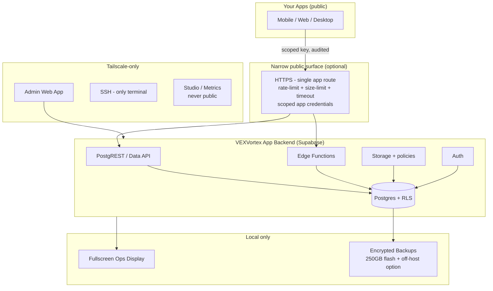

<div align="center">

# ◈ VEXVortex

**A personal backend app — hosted with Supabase.**

Postgres + Auth + REST/Data API + Edge Functions + Storage, secured with Row Level Security from day one.
Private admin over Tailscale. Local ops display. No port-forwarding. No secrets in git.

<br/>

[](LICENSE)
[](https://supabase.com)
[](https://www.postgresql.org)
[](https://tailscale.com)
[](https://www.debian.org)
[](.github/workflows/ci.yml)

*Built and maintained by [@jonahchang207](https://github.com/jonahchang207) — single-author project.*

[Features](#-features) • [Architecture](#-architecture) • [Quickstart](#-quickstart) • [Supabase Setup](#-supabase-setup) • [Admin App](#-admin-app-private) • [Security](#-security-model) • [Repo Map](#-repository-map) • [Roadmap](#-roadmap)

</div>

---

## ◇ What is VEXVortex?

VEXVortex is **just an app backend** — not a homelab showcase, not a public platform.

It gives your personal apps one clean Supabase-backed API surface:

- **Postgres** as the source of truth, with **RLS on every exposed table**
- **Supabase Auth + REST/Data API** for clients
- **Edge Functions** for server-side logic
- **Storage** with Storage policies
- **A private admin app** (Tailscale-only, no public login)
- **A local fullscreen ops display** for health at a glance
- **Encrypted rotating backups** with a tested restore drill

> Design note: the reference deployment is a single Debian 13 (`amd64`) machine. There is no router port-forwarding, no public database, no public Studio, no public SSH. Public traffic — only if you need it — is a single narrow HTTPS route. Everything administrative stays on Tailscale.

---

## ◆ Features

| Area | What you get |
|------|--------------|
| **Supabase-native** | Works with managed Supabase today. Compatible schema, RLS, Edge Functions, Storage policies, and a migration path documented in-repo. |
| **RLS-first data boundary** | `TO authenticated` / `TO anon` policies, ownership/tenant checks, `USING` + `WITH CHECK` on UPDATE, SELECT policy required for UPDATE. No `auth.role()` hacks, no `user_metadata` auth, no casual `SECURITY DEFINER`. |
| **Per-app credentials** | Separate credentials per app/environment, with scopes, rotation, revocation, rate limits, and audit logging. Service-role never touches a client. |
| **Private admin** | Tailscale-only web control plane: overview/alerts, health, logs, backups, allowlisted file browser, guarded SQL console (read-only by default), restart/update gates, full audit log. No browser terminal — SSH only. |
| **Ops display** | Boots straight into a fullscreen local dashboard: CPU/RAM/disk/temp/network, Docker/Supabase health, Tailscale state, uptime, request/error rates, backup status, alerts. Auto-recovers after reboot, power loss, network loss, or browser crash. |
| **Backups that survive reality** | Encrypted rotating backups for Postgres, Storage objects, and config on a 250 GB flash drive. Tolerates a missing drive, alerts visibly, and includes an isolated restore drill. One local copy is not DR — off-host copy is documented. |
| **Hardened defaults** | Default-deny firewall, key-only SSH (no root, no passwords), auto security updates, time sync, journald limits, pinned Docker images, least-privilege containers, no Docker socket in the browser. |
| **Reproducible ops** | Idempotent installer, declarative version-pinned infra, health gates, preflight backups, maintenance mode, update/rollback runbooks. |

---

## ◈ Architecture



**Trust boundaries:**

1. Client ≠ trusted. `Origin`, `Referer`, UA, IP, or app name never prove identity.
2. RLS is the data boundary — not client code, not a proxy check.
3. Service-role / DB passwords live server-side only, generated locally, never in git.
4. Admin requires Tailscale identity **plus** app authorization, short-lived HttpOnly cookies, CSRF, strict CSP.
5. Destructive actions need confirmation + reason + audit event + health/backup preflight.

---

## ▶ Quickstart

### 1. Prerequisites

- A Supabase project (managed — fastest path), **or** the pinned self-hosted Compose in `infra/` when you add it
- Node 20+ / pnpm or npm (for the admin app when added), Docker 25+ + Compose v2 (for self-host parity), Tailscale account
- No port-forwarding required. Outbound-only networking.

### 2. Clone

```bash
git clone https://github.com/jonahchang207/VEXVortex.git
cd VEXVortex
```

### 3. Configure (no secrets in git)

```bash
cp .env.example .env
# fill in your own Supabase URL + anon key locally — never commit .env
```

See [.env.example](.env.example) for the full allowlist. Real secrets stay on the machine that needs them, with `0600` permissions.

### 4. Run the prompt sequence

This repo is prompt-driven by design. Work in order:

| # | File | Purpose |
|---|------|---------|
| 1 | [`PROMPT_MAIN_BUILD.md`](PROMPT_MAIN_BUILD.md) | Build the app backend, installer, hardening, ingress, backups, dashboard, migration + update runbooks |
| 2 | [`PROMPT_TAILSCALE_ADMIN_APP.md`](PROMPT_TAILSCALE_ADMIN_APP.md) | Build the private Tailscale-only admin control plane |
| 3 | [`PROMPT_SECURITY_AUDIT.md`](PROMPT_SECURITY_AUDIT.md) | Non-destructive defensive audit + go/no-go for any public route |

> Destructive steps (wipe, migrate prod data, rotate creds, firewall changes) always require an explicit confirmation right before execution, plus a rollback/backup path.

---

## ◇ Supabase Setup

VEXVortex is hosted **with Supabase**. Managed Supabase is the default; self-hosted Compose is a pinned, documented alternative — not a fork in behavior.

### Managed path (recommended to start)

1. Create a project at [supabase.com](https://supabase.com).
2. Create schemas per app (e.g. `app_notes`, `app_tracker`) — avoid dumping everything in `public`.
3. Enable RLS on **every** table in an exposed schema.
4. Add policies for your real ownership model. Template:

```sql
-- RLS on,Least-privilege to authenticated only
alter table app_notes.notes enable row level security;

-- Read: owner only
create policy "notes_select_owner"
on app_notes.notes for select
to authenticated
using (owner_id = (select auth.uid()));

-- Insert: owner must match
create policy "notes_insert_owner"
on app_notes.notes for insert
to authenticated
with check (owner_id = (select auth.uid()));

-- Update: needs USING + WITH CHECK + a SELECT policy (already above)
create policy "notes_update_owner"
on app_notes.notes for update
to authenticated
using (owner_id = (select auth.uid()))
with check (owner_id = (select auth.uid()));

-- Delete: owner only
create policy "notes_delete_owner"
on app_notes.notes for delete
to authenticated
using (owner_id = (select auth.uid()));
```

5. Create one set of credentials per app/environment. Scope them, rate-limit them, log them.
6. Keep `service_role` server-side only (Edge Functions / admin backend). Never ship it in a client, never log it.
7. Never use editable `user_metadata` for authorization — use server-controlled claims or DB-owned tenancy columns.

### Self-hosted parity

When `infra/` lands, it pins the official Supabase Docker Compose release, deploys Postgres + PostgREST + Edge Functions + Storage (+ Realtime only if required), and documents managed-vs-self-hosted differences: single-project model, no managed branching/backups/platform API, your responsibility for updates, backups, and TLS.

Migration tooling covers: schema/data, Storage objects, Edge Functions, env vars, RLS verification, and cutover/rollback.

---

## ◈ Admin App (private)

Built per [`PROMPT_TAILSCALE_ADMIN_APP.md`](PROMPT_TAILSCALE_ADMIN_APP.md). Lives in [`apps/admin/`](apps/admin/).

- Binds to localhost / Tailscale only. Fails closed if pointed at a public interface.
- Tailscale identity + separate admin authz. Short sessions, HttpOnly/SameSite cookies, CSRF, strict CSP, secure headers.
- Overview/alerts, graphs, Docker/Supabase health, safe log filtering, Tailscale status, backup/restore workflow, allowlisted file browser, metadata viewer + guarded SQL console, restart/update gates, config status, audit log.
- No browser terminal. SSH remains the only terminal path.
- Every privileged action: confirm → reason → audit event → preflight → result linked to logs.

See [`apps/admin/AGENTS.md`](apps/admin/AGENTS.md) for the non-negotiables.

---

## ◎ Local Ops Display

A dedicated fullscreen dashboard — no browser chrome, no desktop workflow, auto-restart.

Shows: CPU / RAM / disk / temp / network, Docker + Supabase health, Tailscale state, uptime, request/error rates, backup status, active alerts — with timestamps and stale-data indicators. Recovers after reboot, power loss, network loss, browser crash, and service failure.

---

## ■ Security Model

Read [`AGENTS.md`](AGENTS.md) and [`security/AGENTS.md`](security/AGENTS.md) first. The short version:

- **Never public:** Postgres, Docker, Studio, admin app, SSH, metrics, Tailscale admin.
- **Never in git:** `service_role`, DB passwords, tunnel tokens, SSH keys, Tailscale auth keys.
- **Never trusted:** `Origin`, `Referer`, User-Agent, client IP, app name.
- **Always RLS:** every exposed table, real tenant checks, no broad grants, no casual `SECURITY DEFINER`.
- **Always audited:** admin actions, credential issuance/rotation/revocation, restores, updates.
- **Always reversible:** backup before migrate/update, documented rollback, tested restore.
- **Tests are non-destructive:** rate-limited, scoped to this server/containers, no LAN-wide scans, no DoS, no brute-force, no data mutation.

Security review follows [`PROMPT_SECURITY_AUDIT.md`](PROMPT_SECURITY_AUDIT.md) and ends with a go/no-go for any public exposure plus a 30-day maintenance plan.

---

## ◐ Repository Map

```text
VEXVortex/
├── AGENTS.md                    # Mission + non-negotiable safety rules (read first)
├── PROMPT_MAIN_BUILD.md         # Prompt 1 — app backend + hardening + backups + runbooks
├── PROMPT_TAILSCALE_ADMIN_APP.md# Prompt 2 — private admin control plane
├── PROMPT_SECURITY_AUDIT.md     # Prompt 3 — authorized defensive review
├── apps/
│   └── admin/                   # Private Tailscale-only admin app (spec in Prompt 2)
├── docs/                        # Operator docs — commands, recovery, limits, no secrets
├── infra/                       # Pinned Compose, systemd, firewall, Tailscale, ingress
├── security/                    # Threat model, audit reports, retest checklists
├── .env.example                 # Safe config template (no real values)
└── .github/workflows/ci.yml     # Docs/secret-hygiene checks
```

Sub-agent contracts:

- [`apps/admin/AGENTS.md`](apps/admin/AGENTS.md) — private control plane rules
- [`docs/AGENTS.md`](docs/AGENTS.md) — operator-doc rules (no secrets/PII)
- [`infra/AGENTS.md`](infra/AGENTS.md) — declarative, pinned, idempotent infra
- [`security/AGENTS.md`](security/AGENTS.md) — non-destructive assessment only

---

## ◑ Definition of Done

The app survives **reboot, network loss, Docker failure, and a failed backup without silent data loss**, and provides:

- [ ] Tested restore (isolated DB + Storage drill)
- [ ] Visible health (admin + local display, no fake metrics)
- [ ] Auditable admin actions
- [ ] Pinned versions + lockfiles
- [ ] Health-gated updates with rollback
- [ ] RLS negative-case tests passing
- [ ] No public management surface
- [ ] Clear migration path from managed Supabase projects

---

## ○ Roadmap

- [ ] ADR + monorepo scaffold (`.gitignore`, `.env.example`, version policy, CI, rollback plan)
- [ ] Idempotent Debian installer + OS hardening + firewall + fail2ban-scope
- [ ] Pinned Supabase Compose + secret workflow + isolated networks
- [ ] Narrow HTTPS app ingress + health endpoints (no secret disclosure)
- [ ] Per-app credential design + rotation/revocation + audit
- [ ] Encrypted backups + retention + integrity checks + restore drill
- [ ] Monitoring + local fullscreen display
- [ ] Migration runbook (schema/data/storage/functions/RLS/cutover)
- [ ] Update/rollback runbook + maintenance mode
- [ ] Resilience tests (reboot/network/restart/failed-backup/restore/firewall/RLS)
- [ ] Admin app v1 (per Prompt 2) + threat model
- [ ] Security audit v1 (per Prompt 3) + go/no-go

---

## ✦ Contributing

This is a **single-maintainer project** by Jonah Chang. Issues and ideas are welcome; pull requests may be closed in favor of a maintainer-authored change to keep history clean and attribution unambiguous.

1. Open an issue describing the change + rollback plan.
2. Never include secrets, tokens, private IPs, or personal identifiers.
3. Keep changes small, pinned, and reversible.

See [CONTRIBUTING.md](CONTRIBUTING.md) and [SECURITY.md](SECURITY.md).

---

## ♥ Author & Attribution

**Jonah Chang — [@jonahchang207](https://github.com/jonahchang207)**

- Single author and maintainer. No other contributors.
- Every commit in this repository is authored as `jonahchang207 <jonahchang207@gmail.com>`.
- If you fork, please keep the MIT attribution and do not imply endorsement.

Contact via GitHub issues. Do not post secrets in issues, discussions, or logs.

---

## ◆ License

MIT © 2026 Jonah Chang. See [LICENSE](LICENSE).

Built with Supabase (Postgres, Auth, Edge Functions, Storage). Supabase is a trademark of its respective owner; this project is independent and not affiliated with or endorsed by Supabase, Tailscale, or Debian.

---

<div align="center">

**VEXVortex — one small backend for your personal apps. Supabase-hosted. RLS-enforced. Quietly reliable.**

`git clone https://github.com/jonahchang207/VEXVortex.git`

</div>
