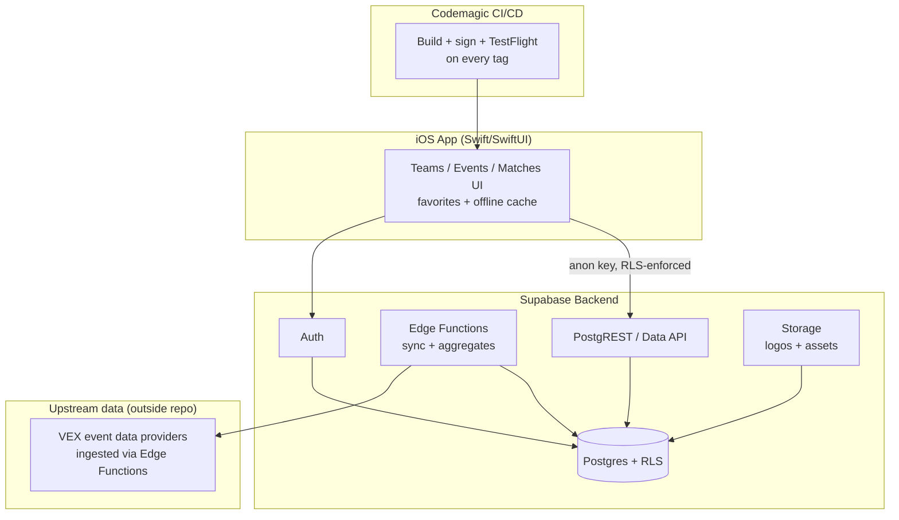

<div align="center">

# ◈ VEXVortex

**VEX Robotics stats — native iOS app backed by Supabase, shipped with Codemagic.**

Teams, events, matches, rankings, and performance insight for VEX V5RC — fast, offline-tolerant, RLS-secured from day one.

<br/>

[](LICENSE)
[](https://supabase.com)
[](ios/)
[](ios/)
[](codemagic.yaml)
[](.github/workflows/ci.yml)

*Built and maintained by [@jonahchang207](https://github.com/jonahchang207) — single-author project.*

[Features](#-features) • [Architecture](#-architecture) • [Quickstart](#-quickstart) • [Supabase Backend](#-supabase-backend) • [iOS App](#-ios-app) • [Codemagic](#-codemagic-cicd) • [Security](#-security-model) • [Repo Map](#-repository-map) • [Roadmap](#-roadmap)

</div>

---

## ◇ What is VEXVortex?

VEXVortex is a **VEX Robotics stats application**: look up teams, browse events, drill into matches and rankings, and track performance over a season.

- **Backend:** Supabase (Postgres + RLS, Auth, REST/Data API, Edge Functions, Storage)
- **Client:** native **iOS** app (Swift/SwiftUI)
- **Ship pipeline:** **Codemagic** for iOS builds, signing, TestFlight, and release

> Scope note: self-hosting / homelab appliance work is a **separate project** and does not live here. This repo is the stats app + its Supabase backend + the iOS client + Codemagic pipeline. Some appliance-spec files still present in this repo predate that split and are pending move-out (see [Repo Map](#-repository-map)).

---

## ◆ Features

| Area | What you get |
|------|--------------|
| **Team lookup** | Search teams, view profiles, season history, event results |
| **Events & matches** | Browse events, divisions, qualification + elimination matches, scores |
| **Rankings & stats** | Rankings, OPR/DPR-style aggregates and per-team trends (where data supports it) |
| **Favorites & offline** | Favorite teams/events, cached reads for pit-side use with stale-data indicators |
| **Supabase-native** | Postgres source of truth, RLS on every exposed table, Edge Functions for sync/aggregation, Storage for assets |
| **iOS-native** | SwiftUI, fast lists, pull-to-refresh, dark mode, accessibility labels, no fake data — every number links to its source |
| **Codemagic shipping** | Signed iOS builds, TestFlight + App Store tracks, secrets from Codemagic variables — never in git |

Feature status is tracked in [Roadmap](#-roadmap). Anything not yet implemented is marked as planned — no placeholder stats are ever shown as real.

---

## ◈ Architecture



**Trust boundaries:**

1. The iOS client is untrusted. `service_role` never ships in the app.
2. RLS is the data boundary — `TO authenticated` / `TO anon` policies, real ownership/tenant checks, `USING` + `WITH CHECK` on UPDATE.
3. Upstream event data is ingested server-side (Edge Functions / scheduled jobs), validated, then served read-mostly to clients.
4. Secrets (Supabase keys, Apple signing, Codemagic variables) live in their own stores — never in git, logs, or screenshots.

---

## ▶ Quickstart

### 1. Prerequisites

- Xcode (for `ios/`), a Supabase project, a Codemagic account connected to this repo
- No port-forwarding, no homelab hardware — this app uses managed Supabase

### 2. Clone

```bash
git clone https://github.com/jonahchang207/VEXVortex.git
cd VEXVortex
```

### 3. Configure (no secrets in git)

```bash
cp .env.example .env
# fill in SUPABASE_URL + SUPABASE_ANON_KEY locally — never commit .env
```

iOS config lives in Xcode schemes / `xcconfig` + Codemagic environment variables — never hardcoded keys. See [iOS App](#-ios-app) and [Codemagic](#-codemagic-cicd).

---

## ◇ Supabase Backend

Spec lives in `supabase/` (migrations, functions, policies). Conventions:

1. One schema per domain (e.g. `vex_teams`, `vex_events` — avoid dumping everything in `public`).
2. RLS **on** for every table in an exposed schema.
3. Least-privilege read policies for public stats; write locked to service roles / admins.
4. Never use editable `user_metadata` for authorization.

Example — public read, restricted write:

```sql
alter table vex.teams enable row level security;

-- Public stats: anyone can read
create policy "teams_select_public"
on vex.teams for select
to anon, authenticated
using (true);

-- Writes: service-side only (no client insert policy at all)
-- Ingest runs with service_role inside Edge Functions / scheduled jobs.
```

Edge Functions handle: upstream sync, score aggregation, cache warming, and any endpoint that must not run client-side.

---

## ◈ iOS App

Lives in `ios/`. Native Swift/SwiftUI client.

- Teams search, team detail, events list, event detail, match detail, rankings
- Favorites persisted on-device; Supabase Auth only if/when accounts land
- Networking: `URLSession` + `Codable` against Supabase REST; DTOs versioned alongside `supabase/` migrations
- Offline: cached reads with explicit stale timestamps; writes (favorites) are local-first
- No secrets in the bundle beyond the `anon` key; `service_role` never included
- Accessibility: labels on every stat, Dynamic Type, VoiceOver-tested lists

Local dev:

```bash
# open the project (once ios/ lands)
open ios/VEXVortex.xcodeproj
# select the VEXVortex scheme, set SUPABASE_URL / SUPABASE_ANON_KEY via xcconfig or scheme env
```

---

## ◉ Codemagic CI/CD

Pipeline is defined in `codemagic.yaml` at the repo root. Codemagic builds, signs, and ships the iOS app.

- Triggers: PR builds (unsigned / dev signing) + tagged releases → TestFlight / App Store
- Signing: Apple Developer Portal + App Store Connect API key stored as Codemagic variables / code-signing identities — never in git
- Supabase values injected as Codemagic environment variable groups per track (dev vs prod)
- Artifacts: `.ipa` + dSYMs; TestFlight notes auto-attached per build
- Status checks gate merges; `ci.yml` still runs docs/secret-hygiene on GitHub Actions

Setup:

1. Connect this repo in Codemagic → select `codemagic.yaml`.
2. Add variable groups: `supabase_prod` (`SUPABASE_URL`, `SUPABASE_ANON_KEY`), Apple signing files.
3. Run a dev build, then promote a tag (e.g. `v0.1.0`) to TestFlight.

See [`codemagic.yaml`](codemagic.yaml) for the documented starter workflow.

---

## ■ Security Model

- **Never in git:** `service_role`, DB passwords, Apple keys/profiles, App Store Connect API keys, Codemagic variables, private IPs.
- **Never trusted:** `Origin`, `Referer`, User-Agent, client IP, app name, or anything the iOS bundle claims about itself.
- **Always RLS:** every exposed table; no broad grants; no casual `SECURITY DEFINER`.
- **Tests are non-destructive:** rate-limited, scoped to this project's Supabase instance and explicitly listed endpoints.

See [SECURITY.md](SECURITY.md). Report issues via a private GitHub Security Advisory — never post secrets in issues.

---

## ◐ Repository Map

```text
VEXVortex/
├── README.md              # This file — VEX stats app branding
├── AGENTS.md              # Agent instructions for this app repo
├── LICENSE                # MIT © 2026 Jonah Chang
├── codemagic.yaml         # Codemagic iOS pipeline (build/sign/TestFlight)
├── .env.example           # Safe Supabase template (no real values)
├── ios/                   # Native iOS app (Swift/SwiftUI) — landing zone
├── supabase/              # Migrations, Edge Functions, RLS policies — landing zone
├── docs/                  # Operator/user docs — no secrets
├── .github/workflows/     # GitHub Actions hygiene checks
│   └── ci.yml
├── apps/admin/            # LEGACY appliance spec — pending move to self-host project
├── infra/                 # LEGACY appliance spec — pending move to self-host project
├── security/              # App security notes (appliance audit docs pending move)
├── PROMPT_MAIN_BUILD.md      # LEGACY appliance prompt — pending move
├── PROMPT_TAILSCALE_ADMIN_APP.md  # LEGACY appliance prompt — pending move
└── PROMPT_SECURITY_AUDIT.md  # LEGACY appliance prompt — pending move
```

> The `LEGACY` entries above predate the split between this stats app and the separate self-hosting project. They are kept temporarily so nothing is lost, and will be moved out — not developed here.

---

## ◑ Roadmap

- [ ] `supabase/` scaffold: schemas (`vex` domain), RLS policies, seed + migration chain
- [ ] Upstream sync Edge Function (teams/events/matches) + scheduled refresh + backfill
- [ ] Aggregates: rankings, per-team trends, event summaries
- [ ] `ios/` scaffold: SwiftUI shell, networking layer, teams/events/matches/rankings screens
- [ ] Favorites + offline cache with stale indicators
- [ ] `codemagic.yaml` wired to real bundle ID + TestFlight track, first dev build green
- [ ] Auth (only if needed for sync/favorites across devices) with RLS tenant checks
- [ ] Screenshots, App Store metadata, privacy policy
- [ ] TestFlight beta → 1.0
- [ ] Move appliance-legacy files to the self-host project repo

---

## ✦ Contributing

Single-maintainer project by **Jonah Chang**. Issues and ideas are welcome; PRs may be closed in favor of a maintainer-authored change to keep history clean.

1. Open an issue first: what, why, rollback plan, test evidence.
2. Never include secrets, tokens, private data, or personal identifiers.
3. Keep changes small, pinned, and reversible.

See [CONTRIBUTING.md](CONTRIBUTING.md) and [SECURITY.md](SECURITY.md).

---

## ♥ Author & Attribution

**Jonah Chang — [@jonahchang207](https://github.com/jonahchang207)**

- Single author and maintainer. No other contributors.
- Every commit is authored as `jonahchang207 <jonahchang207@gmail.com>`.
- Forks: keep MIT attribution, don't imply endorsement.

---

## ◆ License

MIT © 2026 Jonah Chang. See [LICENSE](LICENSE).

VEX, V5RC, and related marks belong to their respective owners (REC Foundation / VEX Robotics). This independent project is not affiliated with or endorsed by them, Supabase, Apple, or Codemagic.

---

<div align="center">

**VEXVortex — VEX stats, fast. Supabase backend. Native iOS. Shipped with Codemagic.**

`git clone https://github.com/jonahchang207/VEXVortex.git`

</div>
